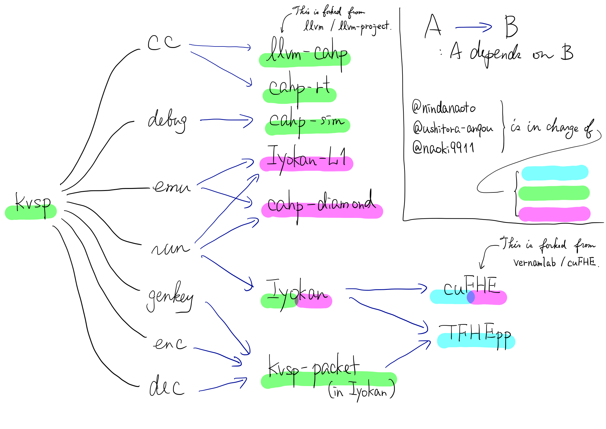

# KVSP; Kyoto Virtual Secure Platform

KVSP is the first virtual secure platform in the world,
which makes your life better.

On VSP you can run your encrypted code as is.
No need to decrypt while running. See [here](https://anqou.net/poc/2019/10/18/post-3106/)
for more details (in Japanese).

KVSP consists of many other sub-projects.
`kvsp` command, which this repository serves, is
a simple interface to use them easily.

## Quick Start

Download a KVSP release and unzip it.
(It has been compiled on Ubuntu 18.04 LTS. If it doesn't work in the following steps,
please read __Build__ section and try to build KVSP on your own.
It may be time-consuming, but not so hard.)

```
$ wget 'https://github.com/virtualsecureplatform/kvsp/releases/latest/download/kvsp.tar.gz'
$ tar xf kvsp.tar.gz
$ cd kvsp_v18/bin    # The directory's name depends on the file you download.
```

Write some C code...

```
$ vim fib.c

$ cat fib.c
static int fib(int n) {
  int a = 0, b = 1;
  for (int i = 0; i < n; i++) {
    int tmp = a + b;
    a = b;
    b = tmp;
  }
  return a;
}

int main(int argc, char **argv) {
  // Calculate n-th Fibonacci number.
  // n is a 1-digit number and given as command-line argument.
  return fib(argv[1][0] - '0');
}
```

...like so. This program (`fib.c`) returns the n-th term of Fibonacci sequence,
as its comment says.

Compile `fib.c` to an executable file `fib`.

```
$ ./kvsp cc fib.c -o fib
```

Let's encrypt it. First, we'll generate a secret key (`secret.key`):

```
$ ./kvsp genkey -o secret.key
```

Then encrypt `fib` with `secret.key` to get an **encrypted** executable `fib.enc`.
We have to pass its command-line arguments here. I chose 5, so the result
of this program will be fib(5)=5.

```
$ ./kvsp enc -k secret.key -i fib -o fib.enc 5
```

Okay. Now we will run `fib.enc` without `secret.key`.
To do this, first we have to make a _bootstrapping key_, which doesn't reveal
the secret key at all but only enables the computation:

```
$ ./kvsp genbkey -i secret.key -o bootstrapping.key
```

Then we will execute the program, but here is a problem:
once it starts running we can't know if it is still running or has already halted,
because **everything about the code is totally encrypted**!

So, we have to decide how many clock cycles to run `fib.enc` at our choice.
It is, say, 20.

```
# If you have GPUs use '-g NUM-OF-GPUS' option.
$ ./kvsp run -bkey bootstrapping.key -i fib.enc -o result.enc -c 20
```

Let's check the result. We'll decrypt `result.enc`:

```
$ ./kvsp dec -k secret.key -i result.enc
...
f0      false
...
```

`f0` is 'finish flag', which is true iff the program ends.
So, 20 cycles were not enough. Let's try another 20;
We can resume from the point where we stopped using 'snapshot' file
(its filename depends on your environment):

```
$ ./kvsp resume -c 20 -i kvsp_20200517002413.snapshot -o result.enc -bkey bootstrapping.key
```

Check the result again:

```
$ ./kvsp dec -k secret.key -i result.enc
...
f0      true
...
x8      5
...
```

Finished! x8 register has the returned value from `main()` and it is the correct answer 5.
We could get the correct answer using secure computation!

## More examples?

See the directory `examples/`.

## System Requirements

We ensure that KVSP works on the following cloud services:

- [さくらインターネット 高火力コンピューティング Tesla V100（32GB）モデル](https://www.sakura.ad.jp/koukaryoku/)
- [GCP n1-standard-96 with 8 x NVIDIA Tesla V100](https://cloud.google.com/compute/docs/machine-types?hl=ja#n1_standard_machine_types)
- [AWS EC2 m5.metal](https://aws.amazon.com/ec2/instance-types/c5/)

If you run KVSP locally, prepare a machine with the following devices:

- Intel CPU with AVX2 support (e.g. Intel Core i7-8700)
- 8GB RAM
- NVIDIA GPU (not required but highly recommended)
    - Only NVIDIA Tesla V100 is supported.
    - Other GPUs _may_ work but are not supported.

## Build

Clone this repository:

```
$ git clone https://github.com/virtualsecureplatform/kvsp.git
```

Clone submodules recursively:

```
$ git submodule update --init --recursive
```

Build KVSP:

```
$ make  # It may take a while.
```

Use option `ENABLE_CUDA` if you build KVSP with GPU support:

```
$ make ENABLE_CUDA=1 CUDACXX="/usr/local/cuda/bin/nvcc" CUDAHOSTCXX="/usr/bin/clang-8"
```

## Build KVSP Using Docker

Based on Ubuntu 18.04 LTS image.

```
# docker build -t kvsp-build .
# docker run -it -v $PWD:/build -w /build kvsp-build:latest
```

## Detailed Explanation on KVSP

Kyoto Virtual Secure Platform (KVSP) enables to execute a standard C program while protecting its code on cloud computing platforms.

The main idea of KVSP is emulating a CPU on TFHE, which is one kind of fully homomorphic encryption. By using TFHE we can perform logical operations on ciphertexts.

KVSP runs at 4 second per clock on NVIDIA V100, 2.5s on AWS's c5.metal and 1.5s on 8 V100.

KVSP consists of 6 sub-projects:

- Iyokan: A parallel execution engine for logic gates using homomorphic encryption.
- CAHPv3: Our original ISA for the processor which is emulated in KVSP. Most significant features are 16bit data width and 16/24bit variable instruction width.
- cahp-diamond: Our original CPU which implements CAHPv3. It consists of about 4K logic gates.
- llvm-cahp: LLVM backend for CAHPv3.
- TFHEpp & cuFHE: C++ libraries of TFHE. TFHEpp is a full-scratched library for CPU and cuFHE is modified version of an existing implementation for GPU. They make KVSP faster from a cryptographical point of view.
- kvsp: KVSP's CUI interface.

This is a research project. We are planning to publish a paper.

## Code Owners


